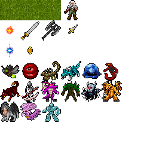

# Vampire Survivor-Like Creation Guide

## 🎮 Bienvenue dans l'aventure!
Bienvenue dans la documentation officielle pour créer votre propre **jeu de type Vampire Survivors** avec Unity! Ce guide complet vous accompagne pas à pas dans le développement d'un survival action-roguelite où vous affronterez des hordes d'ennemis en constante évolution.

> *Combattez, améliorez-vous, et voyez jusqu'où vous pouvez aller!*

## 📚 Guides de Développement
Parcourez notre collection de guides détaillés pour comprendre et implémenter chaque aspect du jeu:

### Mécaniques Fondamentales
- **[Contrôleur de Joueur](guides/player-controller.md)** - Implémentation des mouvements et interactions du joueur
- **[Contrôleur de Caméra](guides/camera-controller.md)** - Configuration du suivi de caméra fluide
- **[Contrôleur d'Ennemi](guides/enemy-controller.md)** - Comportement et déplacement des ennemis
- **[Animation des Ennemis](guides/enemy-animation-guide.md)** - Système d'animation pour les adversaires

### Systèmes de Combat et Vie
- **[Système de Dégâts](guides/combat-system-guide.md)** - Différentes méthodes pour gérer les dégâts des ennemis
- **[Création de Barre de Vie](guides/health-slider-guide.md)** - Mise en place de l'interface de santé
- **[Code de la Barre de Vie](guides/health-code-guide.md)** - Connexion de l'UI avec la logique de jeu

### Ennemis et Systèmes de Spawn
- **[Système de Spawn d'Ennemis Basique](guides/basic-enemy-spawner-guide.md)** - Création d'un système simple pour faire apparaître des ennemis

### Organisation et Structure du Projet
- **[Comprendre et Utiliser les Prefabs](guides/prefabs-guide.md)** - Maîtriser les prefabs pour une meilleure organisation et réutilisation des objets de jeu

## 🛠️ À propos du Projet
Ce projet open-source vous guide à travers la création d'un jeu dans la lignée du populaire "Vampire Survivors", avec:
* Progression constante du personnage
* Vagues d'ennemis de plus en plus difficiles
* Système d'amélioration des capacités
* Gameplay frénétique et addictif

## Ressources et Liens
* [Dépôt GitHub du Projet](https://github.com/Lysdora/survivor-game-unity2D)
* [Site de Documentation Complet](https://lysdora.github.io/survivor-game-unity2D/)

---

Développé avec ❤️ par Lysdora

 
