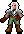

# Guide: Contrôleur de joueur dans Unity



## Introduction

Bienvenue dans ce guide sur le contrôleur de joueur dans Unity! Ce composant est essentiel pour tout jeu, car il permet au joueur de naviguer dans le monde du jeu. Dans ce guide, nous allons analyser en détail le script `PlayerController` utilisé dans notre jeu de type survival.

## Prérequis

- Unity (version récente)
- Des connaissances de base en C#
- Un sprite de personnage avec des animations (idle, walk, etc.)

## Structure du projet

Pour ce tutoriel, nous supposons que vous avez déjà configuré:
- Un GameObject avec un composant Rigidbody2D ou CharacterController
- Un composant Animator attaché au personnage
- Des animations appropriées (au minimum un paramètre booléen "isMoving")

## Analyse du script PlayerController

Plongeons directement dans le code et examinons-le section par section.

### 1. Initialisation des composants

```csharp
// Start is called before the first frame update
void Start()
{
    animator = GetComponent<Animator>();
}
```

La méthode `Start()` est appelée automatiquement avant la première mise à jour de frame. Elle initialise la référence à l'animateur du personnage, qui sera utilisé pour contrôler les animations en fonction des mouvements.

### 2. Gestion des entrées utilisateur

```csharp
// Update is called once per frame
void Update()
{
    Vector3 moveInput = new Vector3(0f, 0f, 0f);
    moveInput.x = Input.GetAxisRaw("Horizontal");
    moveInput.y = Input.GetAxisRaw("Vertical");
    moveInput.Normalize();
    transform.position += moveInput * moveSpeed * Time.deltaTime;
```

La méthode `Update()` est exécutée à chaque frame. Voici ce qui se passe:

1. Nous créons un vecteur `moveInput` initialisé à zéro
2. Nous récupérons les entrées horizontales (gauche/droite) et verticales (haut/bas) via le système d'input d'Unity
3. Nous normalisons le vecteur pour garantir une vitesse constante, même en diagonale
4. Nous mettons à jour la position du personnage en fonction de l'entrée et de la vitesse

> **Note**: La normalisation est cruciale pour le mouvement en diagonale. Sans elle, votre personnage se déplacerait environ 1,4 fois plus vite en diagonale qu'horizontalement ou verticalement!

### 3. Gestion des animations de mouvement

```csharp
if (moveInput.x > 0f || moveInput.y > 0f || moveInput.x < 0 || moveInput.y < 0) // ou moveInput != Vector3.zero
{
    animator.SetBool("isMoving", true);
}
else
{
    animator.SetBool("isMoving", false);
}
```

Cette section détermine si le personnage est en mouvement:

1. Si l'une des composantes du vecteur `moveInput` est non nulle (le joueur appuie sur une touche directionnelle)
2. Nous définissons le paramètre "isMoving" de l'animateur à `true`
3. Sinon, nous le définissons à `false`

Le commentaire suggère une alternative plus élégante: vérifier si `moveInput` est différent de `Vector3.zero`.

### 4. Orientation du sprite du personnage

```csharp
if (moveInput.x > 0) // Je vais à droite
{
    transform.localScale = new Vector3(-1, 1, 1); // Orientation normale
}
else if (moveInput.x < 0) // Je vais à gauche
{
    transform.localScale = new Vector3(1, 1, 1); // Inverser sur l'axe X
}
```

Cette dernière partie gère l'orientation du sprite:

1. Si le joueur se déplace vers la droite, nous définissons l'échelle locale à (-1, 1, 1)
2. Si le joueur se déplace vers la gauche, nous définissons l'échelle locale à (1, 1, 1)

> **Astuce**: Dans ce script, l'inversion utilise l'échelle locale, ce qui suppose que votre sprite de base est orienté vers la gauche (d'où l'inversion pour aller à droite). Si votre sprite est orienté différemment, vous devrez ajuster ces valeurs.

## Améliorations possibles

### 1. Ajout d'une variable de vitesse

Actuellement, la vitesse de déplacement (`moveSpeed`) est mentionnée dans le code mais n'est pas déclarée. Vous devriez ajouter:

```csharp
[SerializeField] private float moveSpeed = 5.0f;
```

L'attribut `[SerializeField]` permet d'ajuster cette valeur depuis l'inspecteur d'Unity.

### 2. Gestion des animations directionnelles

Pour un jeu de type Zelda, vous pourriez vouloir des animations différentes selon la direction:

```csharp
// Détermine la direction principale
if (Mathf.Abs(moveInput.x) > Mathf.Abs(moveInput.y))
{
    // Mouvement horizontal prioritaire
    animator.SetBool("walkingHorizontal", true);
    animator.SetBool("walkingVertical", false);
}
else if (Mathf.Abs(moveInput.y) > 0)
{
    // Mouvement vertical prioritaire
    animator.SetBool("walkingHorizontal", false);
    animator.SetBool("walkingVertical", true);
}
else
{
    // Aucun mouvement
    animator.SetBool("walkingHorizontal", false);
    animator.SetBool("walkingVertical", false);
}
```

### 3. Utilisation du système de physique d'Unity

Plutôt que de modifier directement la position du transform, vous pourriez utiliser le système de physique d'Unity:

```csharp
private Rigidbody2D rb;

void Start()
{
    animator = GetComponent<Animator>();
    rb = GetComponent<Rigidbody2D>();
}

void FixedUpdate() // Pour la physique, utilisez FixedUpdate
{
    rb.velocity = moveInput * moveSpeed;
}
```

Cette approche gère mieux les collisions et suit les meilleures pratiques d'Unity.

## Conclusion

Voilà! Vous avez maintenant une compréhension approfondie du fonctionnement d'un contrôleur de joueur basique dans Unity. Ce script constitue une base solide que vous pourrez étendre avec des fonctionnalités supplémentaires comme:

- Des attaques et capacités spéciales
- Un système d'inventaire
- Des interactions avec les PNJ
- Des effets sonores de pas

N'hésitez pas à expérimenter et à adapter ce code à vos besoins spécifiques. La polyvalence d'Unity vous permet d'étendre facilement ces fonctionnalités de base.

## Exercice pratique

Essayez d'ajouter une fonctionnalité de "dash" au personnage: lorsque le joueur appuie sur une touche spécifique, le personnage se déplace rapidement dans la direction actuelle pendant une courte durée.

[Retour à la page principale](../README.md)
